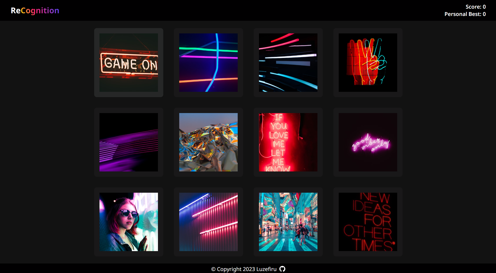

# ReCognition

A memory card game built with React utilizing Functional Component Hooks & Unsplash API.

# Reflection

Working with Unsplash's API proved to be quite difficult for development as it only permits 50 requests per hour. However, their images are top-notch and add a lot of spice to my project.

In the future, I hope to learn back-end development so that I can hide my `.env` variables for my API keys.

I also learned about how different browser vendors offer different CSS properties. `-webkit-` is used by Chromium & Safari, but I still need to research whether my styles apply in Mozilla Firefox's [Gecko](https://developer.mozilla.org/en-US/docs/Glossary/Gecko) engine.

# Favorite Code Snippet

This was the cleanest text gradient I have created thus far:

```CSS
.header__title__accent {
  background-image: linear-gradient(
    245deg,
    hsl(240deg 100% 64%) 0%,
    hsl(340deg 100% 57%) 64%,
    hsl(55deg 100% 50%) 100%
  );
  background-clip: text;
  -webkit-background-clip: text;
  -webkit-text-fill-color: transparent;
}
```

# Output

### [Visit the Website Here](https://luzefiru.github.io/ReCognition/)



# Reference

These were the requirements in The Odin Project's [Project: Memory Card](https://www.theodinproject.com/lessons/node-path-javascript-memory-card) site in order to serve guidelines for application functionality. Aesthetic & design choices relied solely on the developer.
